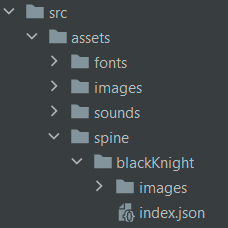

# spine-loader
Webpack loader for configuring spine-animations

### Usage

`npm i spine-loader --save-dev`

```javascript
// webpack config
rules.push({
  type: 'javascript/auto',
  test: /\.json$/,
  include: /spine/,
  loader: 'spine-loader',
});

// some place in src
const configFromJSON = require('@/assets/spine/goblin/index.json')

// output
configFromJSON.skeleton.sprite.src // sprite image
configFromJSON.skeleton.sprite.map // sprite map string
// also you can check your sprite in
// node_modules/.cache/spine-loader

// example usage with PIXI and Spine plugin
const { src, map } = configFromJSON.skeleton.sprite;
const img = document.createElement('img');
img.setAttribute('src', src);
img.onload = () => {
  const spineAtlas = new PIXI.spine
    .TextureAtlas(map, (line, callback) => {
      callback(PIXI.Texture.from(img).baseTexture);
    });

  const spineAtlasLoader = new PIXI.spine.AtlasAttachmentLoader(spineAtlas);
  const spineJsonParser = new PIXI.spine.SkeletonJson(spineAtlasLoader);

  const spineData = spineJsonParser.readSkeletonData(configFromJSON);
  spineData.initScale = configFromJSON.skeleton.scale;

  const spineAnim = new PIXI.spine.Spine(spineData); // your animation instance
  spineAnim.scale.set(spineData.initScale);
};
```

A typical structure of file with animations should
look like (separate assets in "images" subdirs
near with single json file):



### Loader options

There are two additional loader options: scale and skins
for including only useful assets with chosen resolution.

```javascript
// you can specify options like this
rules.push({
  type: 'javascript/auto',
  test: /\.json$/,
  include: /spine/,
  loader: 'spine-loader',
  options: {
    scale: 0.5,
    skins: ['RED_SKIN', 'BLUE_SKIN']
  }
});
// or like this
const configFromJSON = require('@/assets/spine/goblin/index.json?{"scale":0.2}')
```
